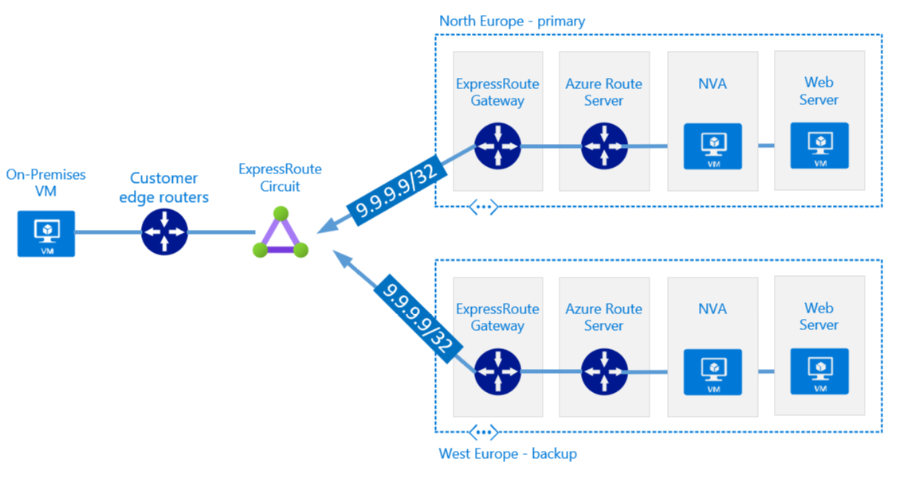
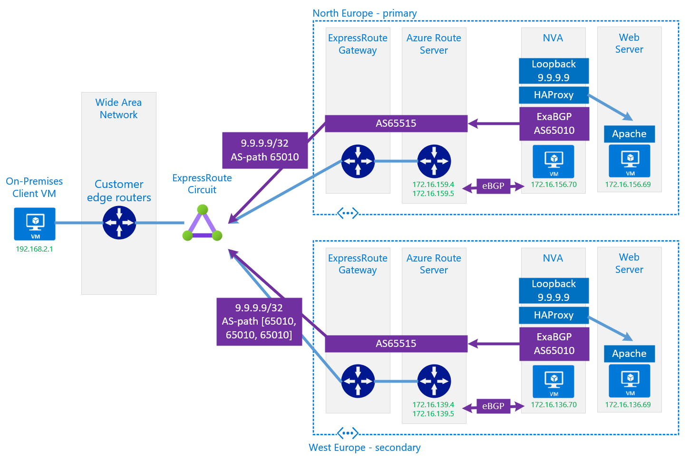
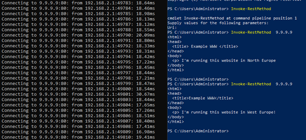
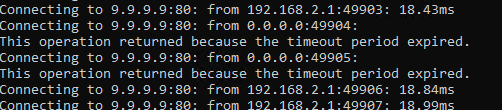

# Azure Route Server - Anycast multi-region load balancing

## Introduction



The subject of load balancing across Azure regions is a common topic within application design in the Cloud. Often in the context of providing HA or DR for an application hosted in Azure, but also for purposes of load sharing and/or blue-green deployments.

If the source, remote endpoints (clients, APIs, etc), are accessing the applications from a public source (public IP, over the Internet) then we have well known patterns that many customers already use, comprised of products like Azure Front Door and Azure Traffic Manager – these products sit at the edge of the Microsoft network, and can therefore naturally intercept requests from clients on the Internet, before the traffic is passed to an Azure Region ([example](https://docs.microsoft.com/en-us/azure/architecture/reference-architectures/app-service-web-app/multi-region)).

However, exploring the ability to provide a network load balancing strategy across regions for endpoints accessing an application from a **private network**, is also something that gets raised from time-to-time.  I summarise the available solutions options in this wider document [here](https://github.com/adstuart/azure-crossregion-private-lb)

**This article is focused on a new pattern that is possible using [Azure Route Server](https://docs.microsoft.com/en-us/azure/route-server/overview) (ARS) and BGP integration with reverse proxy NVAs. In the same way that Azure Front door uses Anycast for resilience over the public Internet, we are able to utilise Azure Route Server to build our own custom Anycastsolution with reachability across our private network**

*This approach offers advantages over traditional DNS based GSLB in respect to performance (no DNS TTL), complexity (no need to make NVA authoritative for DNS ) and scalability (add additional Azure Regions and utilise standard BGP route manipulation to steer traffic to nearest origin)*


## Overview

### Configuration



### North Europe - primary region

#### Pre-req (not covered)
- Build Linux VM *2
- Deploy apache and example website on backend VM
- Enable IP forwarding on NVA NIC
- Deploy ARS, define NVA peer, enable branch-to-branch toggle
- Deploy ExpressRoute Gateway, connect to ExpressRoute Circuit

#### Network Virtual Appliance 
To demonstrate the functionality we will keep the config as simple and lightweight as possible;
- [HAproxy](http://www.haproxy.org/) as reverse proxy function
- [ExaBGP](https://github.com/Exa-Networks/exabgp) as BGP speaker

```
# SSH to NVA
sudo apt update
sudo apt install exabgp
sudo apt install haproxy
# Loopback IF
sudo ifconfig lo:9 9.9.9.9 netmask 255.255.255.255 up
# ExaBGP config
vi conf.ini
neighbor 172.16.159.4 {
	router-id 172.16.156.70;
	local-address 172.16.156.70;
	local-as 65010;
	peer-as 65515;
	static {
	route 9.9.9.9/32 next-hop 172.16.156.70 as-path;
	}
}
neighbor 172.16.159.5 {
	router-id 172.16.156.70;
	local-address 172.16.156.70;
	local-as 65010;
	peer-as 65515;
	static {
	route 9.9.9.9/32 next-hop 172.16.156.70;
	}
}
## HAProxy config
 vi /etc/haproxy/haproxy.cfg
frontend http_front
   bind *:80
   stats uri /haproxy?stats
   default_backend http_back
backend http_back
   balance roundrobin
   server backend01 172.16.156.69:80 check
   
   sudo systemctl restart haproxy

## Start ExaBGP
exabgp ./conf.ini
```

#### Verify

```
adam@Azure:~$ az network routeserver peering list-learned-routes -n exabgp --routeserver hub-rs -g lab-ars-ne
{
  "RouteServiceRole_IN_0": [
    {
      "asPath": "65010",
      "localAddress": "172.16.159.4",
      "network": "9.9.9.9/32",
      "nextHop": "172.16.156.70",
      "origin": "EBgp",
      "sourcePeer": "172.16.156.70",
      "weight": 32768
    }
  ],
  "RouteServiceRole_IN_1": [
    {
      "asPath": "65010",
      "localAddress": "172.16.159.5",
      "network": "9.9.9.9/32",
      "nextHop": "172.16.156.70",
      "origin": "EBgp",
      "sourcePeer": "172.16.156.70",
      "weight": 32768
    }
```

### West Europe - secondary region

#### Pre-req (not covered)
- Build Linux VM *2
- Deploy apache and example website on backend VM
- Enable IP forwarding on NVA NIC
- Deploy ARS, define NVA peer, enable branch-to-branch toggle
- Deploy ExpressRoute Gateway, connect to ExpressRoute Circuit

#### Network Virtual Appliance 
To demonstrate the functionality we will keep the config as simple and lightweight as possible;
- [HAproxy](http://www.haproxy.org/) as reverse proxy function
- [ExaBGP](https://github.com/Exa-Networks/exabgp) as BGP speaker _(note longer as-path length [prepend] within static route config, within this secondary region)_

```
# SSH to NVA
sudo apt update
sudo apt install exabgp
sudo apt install haproxy
# Loopback IF
sudo ifconfig lo:9 9.9.9.9 netmask 255.255.255.255 up
# ExaBGP config
vneighbor 172.16.139.4 {
	router-id 172.16.136.70;
	local-address 172.16.136.70;
	local-as 65010;
	peer-as 65515;
	static {
	route 9.9.9.9/32 next-hop 172.16.136.70 as-path [ 65010 65010 65010 ];
	}
}
neighbor 172.16.139.5 {
	router-id 172.16.136.70;
	local-address 172.16.136.70;
	local-as 65010;
	peer-as 65515;
	static {
	route 9.9.9.9/32 next-hop 172.16.136.70 as-path [ 65010 65010 65010 ];
	}
}
## HAProxy config
 vi /etc/haproxy/haproxy.cfg
frontend http_front
   bind *:80
   stats uri /haproxy?stats
   default_backend http_back
backend http_back
   balance roundrobin
   server backend01 172.16.136.69:80 check
   
   sudo systemctl restart haproxy

 ## Start ExaBGP
exabgp ./conf.ini
```

#### Verify

```
adam@Azure:~$  az network routeserver peering list-learned-routes -n exa --routeserver hub-rs -g lab-ars-we
{
  "RouteServiceRole_IN_0": [
    {
      "asPath": "65010-65010-65010",
      "localAddress": "172.16.139.4",
      "network": "9.9.9.9/32",
      "nextHop": "172.16.136.70",
      "origin": "EBgp",
      "sourcePeer": "172.16.136.70",
      "weight": 32768
    }
  ],
  "RouteServiceRole_IN_1": [
    {
      "asPath": "65010-65010-65010",
      "localAddress": "172.16.139.5",
      "network": "9.9.9.9/32",
      "nextHop": "172.16.136.70",
      "origin": "EBgp",
      "sourcePeer": "172.16.136.70",
      "weight": 32768
    }
  ],
  "value": null
}
```

## Resilience demonstration

### Baseline

Check ExpressRoute Circuit (MSEE) receiving Anycast IP from both regions.

```
adam@Azure:~$ az network express-route list-route-tables -g gbb-er-lab-ne -n Intercloud-London --path primary --peering-name AzurePrivatePeering --query value -o table | grep 9.9.9.9

9.9.9.9/32         172.16.138.12               0         65515 65010 65010 65010
9.9.9.9/32         172.16.138.13               0         65515 65010 65010 65010
9.9.9.9/32         172.16.158.12               0         65515 65010
9.9.9.9/32         172.16.158.13*              0         65515 65010
```

From On-Premises client verify reachability. 

```
PS C:\Users\Administrator> Invoke-RestMethod  9.9.9.9
<html>
<head>
  <title> Example WWW </title>
</head>
<body>
  <p> I'm running this website in North Europe
</body>
</html>
```

Http://9.9.9.9 is served from North Europe as expected from our configuration. as as-path is shorter to this region, and therefore the preferred route chosen by the MSEE.

### Primary region failure

Simulate failure by shutting down ExaBGP on NVA in primary region. NVA stops advertising routes to ER-GW, which retracts from MSEE. Leaving behind only the West Europe originated routes with the longer as-path length.

```
adam@Azure:~$ az network express-route list-route-tables -g gbb-er-lab-ne -n Intercloud-London --path primary --peering-name AzurePrivatePeering --query value -o table | grep 9.9.9.9
WARNING: This command is in preview and under development. Reference and support levels: https://aka.ms/CLI_refstatus
9.9.9.9/32         172.16.138.12               0         65515 65010 65010 65010
9.9.9.9/32         172.16.138.13               0         65515 65010 65010 65010
```

We are now in a failed-over state and Http://9.9.9.9 is served from West Europe as expected.

```
PS C:\Users\Administrator> Invoke-RestMethod  9.9.9.9
<html>
<head>
  <title>Example WWW</title>
</head>
<body>
  <p> I'm running this website in West Europe!
</body>
</html>
```

No pings lost, almost instant failover.



### Primary region recovery

Simulate recovery of primary region by restarting ExaBGP on NVA in primary region. NVA starts advertising routes to ER-GW, which advertises to MSEE, making North Europe the preferred region again due to shorter as-path.

```
adam@Azure:~$ az network express-route list-route-tables -g gbb-er-lab-ne -n Intercloud-London --path primary --peering-name AzurePrivatePeering --query value -o table | grep 9.9.9.9
WARNING: This command is in preview and under development. Reference and support levels: https://aka.ms/CLI_refstatus
9.9.9.9/32         172.16.158.13               0         65515 65010
9.9.9.9/32         172.16.158.12*              0         65515 65010
9.9.9.9/32         172.16.138.12               0         65515 65010 65010 65010
9.9.9.9/32         172.16.138.13               0         65515 65010 65010 65010
```

Http://9.9.9.9 is again being served from primary region.

```
PS C:\Users\Administrator> Invoke-RestMethod  9.9.9.9
<html>
<head>
  <title> Example WWW </title>
</head>
<body>
  <p> I'm running this website in North Europe
</body>
</html>
```

Total fail-back time <5ms.



## Caveat Empor

The above is proof of value/function only, a production grade implementation would add additional resilience, security and automation, both on the frontend network infra, but also system state sync on the backend.

## Future enhancement / work

The concept of using ARS to originate Anycast addresses within Azure is a powerful new tool in the Azure Networking toolkit, one which in the future will hopefully be leveraged by 1st-party and 3rd-party offerings alike. Examples could include;

- Optimized open sourced based designs (iterating on the design presented in the document) to add a level of automation. For example linking state of ExaBGP announcement to reachability of backend server within HAProxy. (Similar: https://blog.plessis.info/blog/2020/02/11/haproxy-exabgp.html)
- Enterprise NVA vendors of reverse proxy solutions should look to offer reference architecture that integrate with Azure Route Server for Anycast based designs
- Anycast based DNS designs to simplify hybrid Enterprise DNS designs


